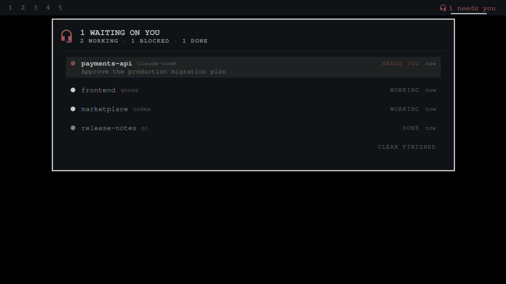

<p align="center"></p>

# Crew Chief

Every running Claude Code session in your Omarchy bar — and a loud pill the moment one
is blocked waiting on you.

You're running four agent sessions across four projects. One of them has been sitting on a
permission prompt for six minutes. Which one? Crew Chief knows: a bar pill counts your
running sessions — `󰋎 4` — and the moment a session is blocked waiting on you or finishes
its run, the pill goes loud in your theme's active color: `󰋎 2 need you`. The panel lists
the whole fleet, attention first: project, state, how long it's been waiting, and the
actual prompt it's stuck on.



The existing agent widgets tell you about your *quota*. Crew Chief tells you **who needs
you right now** — it's fed by Claude Code's own hook events, not by polling a usage API.

## Install

```bash
omarchy plugin add https://github.com/jeremylongshore/omarchy-crew-chief-entry --enable
```

Add **Crew Chief** to your bar layout (Omarchy menu → Bar), then wire the Claude Code hook
(one command, idempotent, backs up your settings first):

```bash
~/.config/omarchy/plugins/omarchy-crew-chief-entry/hooks/install-claude-hooks
```

Restart any running Claude Code sessions so they pick up the hooks. That's it — new
sessions report in automatically.

## How it works

Claude Code fires [hook events](https://code.claude.com/docs/en/hooks) at lifecycle
moments. The installed hook (`hooks/crew-chief-event`, ~40 lines of bash + jq) writes one
tiny JSON state file per session under `~/.local/state/omarchy/crew-chief/`:

| Claude Code event | Session state |
| --- | --- |
| `SessionStart`, `UserPromptSubmit` | `WORKING` |
| `Notification` (permission prompt, waiting on input) | `NEEDS YOU` |
| `Stop` (finished its run) | `DONE` |
| `SessionEnd` | removed |

The widget polls that spool (default every 3s — it's a handful of local files, effectively
free) and renders the fleet. No network. No transcript content. No secrets — the spool
carries session id, project directory, state, timestamp, and the notification headline.

## Using the panel

- **Rows sort attention-first** — the session that's waited longest on you is on top,
  with its blocking prompt under the project name.
- **Left-click a row**: best-effort jump to that project's terminal window
  (`hyprctl dispatch focuswindow`).
- **Right-click a row**: dismiss it from the list.
- **CLEAR FINISHED**: sweep away all `DONE` rows at once.
- Stale sessions (no event for 4h, configurable) drop off automatically.

## Settings

| Key | Default | What it does |
| --- | --- | --- |
| `pollSec` | `3` | Spool poll interval (seconds) |
| `staleMinutes` | `240` | Forget sessions with no events after this long |
| `showDone` | `On` | Keep finished sessions visible until dismissed |

## Remove

```bash
omarchy plugin remove io.github.jeremylongshore.crew-chief
```

To unwire the hook, restore the backup the installer made
(`~/.claude/settings.json.crew-chief.bak`) or delete the `crew-chief-event` entries from
`~/.claude/settings.json`.

## Dependencies

- `jq` (ships with Omarchy) — used by the hook script.
- [Claude Code](https://code.claude.com) with hooks support (any 2025+ release).

## Development

Data layer and hook script are covered by a node test suite (no QML required):

```bash
node --test tests/*.test.js
```

## License

MIT — see [LICENSE](LICENSE).
